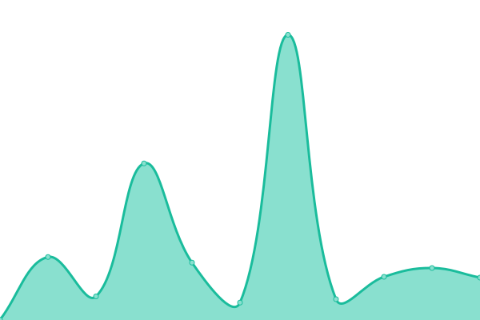
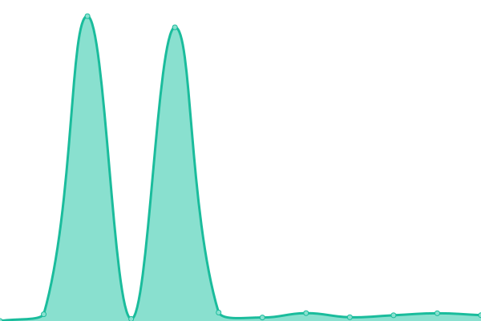

# [📈 Live Status](https://status.yjr.me): <!--live status--> **🟧 Partial outage**

This repository contains the open-source uptime monitor and status page for [hustlyt](https://status.yjr.me), powered by [Upptime](https://github.com/upptime/upptime).

With [Upptime](https://upptime.js.org), you can get your own unlimited and free uptime monitor and status page, powered entirely by a GitHub repository. We use [Issues](https://github.com/hustlyt/upptime/issues) as incident reports, [Actions](https://github.com/hustlyt/upptime/actions) as uptime monitors, and [Pages](https://status.yjr.me) for the status page.

<!--start: status pages-->
<!-- This summary is generated by Upptime (https://github.com/upptime/upptime) -->
<!-- Do not edit this manually, your changes will be overwritten -->
<!-- prettier-ignore -->
| URL | 状态 | History | Response Time | 上线时间 |
| --- | ------ | ------- | ------------- | ------ |
|  [导航](https://nav.yjr.me) | 🟥 异常 | [.yml](https://github.com/hustlyt/upptime/commits/HEAD/history/.yml) | 

 1040ms
     
 | 

<a href="https://status.yjr.me/history/">99.82%</a>
    

|  [memos笔记](https://memos.yjr.me) | 🟩 正常 | [memos.yml](https://github.com/hustlyt/upptime/commits/HEAD/history/memos.yml) | 

 213ms
     
 | 

<a href="https://status.yjr.me/history/memos">100.00%</a>
    

|  [GPT Web](https://chat.yjr.me) | 🟩 正常 | [gpt-web.yml](https://github.com/hustlyt/upptime/commits/HEAD/history/gpt-web.yml) | 

 186ms
     
 | 

<a href="https://status.yjr.me/history/gpt-web">100.00%</a>
    

|  [one api](https://one.yjr.me) | 🟥 异常 | [one-api.yml](https://github.com/hustlyt/upptime/commits/HEAD/history/one-api.yml) | 

 1143ms
     
 | 

<a href="https://status.yjr.me/history/one-api">99.82%</a>
    

|  [探针](https://nezha.yjr.me) | 🟥 异常 | [.yml](https://github.com/hustlyt/upptime/commits/HEAD/history/.yml) | 

 1040ms
     
 | 

<a href="https://status.yjr.me/history/">99.82%</a>
    

|  [Telegram图床](https://img.130712.xyz) | 🟩 正常 | [telegram.yml](https://github.com/hustlyt/upptime/commits/HEAD/history/telegram.yml) | 

 209ms
     
 | 

<a href="https://status.yjr.me/history/telegram">100.00%</a>
    

<!--end: status pages-->

[**Visit our status website →**](https://status.yjr.me)

## 📄 License

- Powered by: [Upptime](https://github.com/upptime/upptime)
- Code: [MIT](./LICENSE) © [hustlyt](https://status.yjr.me)
- Data in the `./history` directory: [Open Database License](https://opendatacommons.org/licenses/odbl/1-0/)
